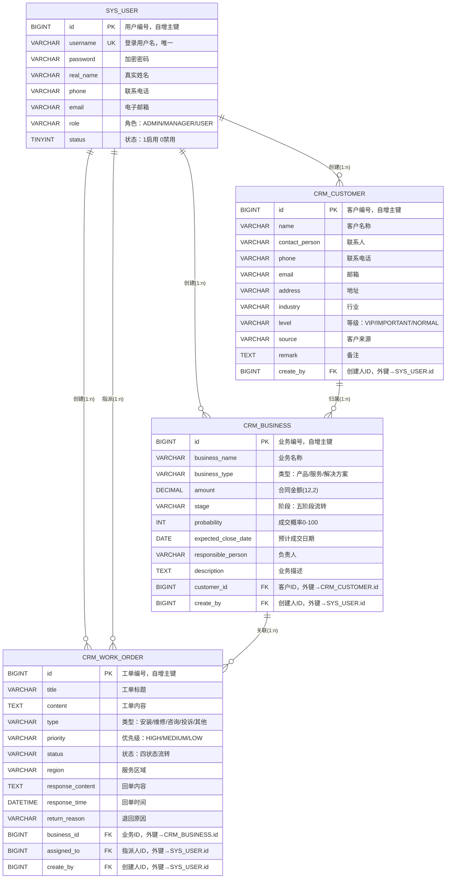

```mermaid
erDiagram
    SYS_USER {
        BIGINT id PK "用户编号，自增主键"
        VARCHAR username UK "登录用户名，唯一"
        VARCHAR password "加密密码"
        VARCHAR real_name "真实姓名"
        VARCHAR phone "联系电话"
        VARCHAR email "电子邮箱"
        VARCHAR role "角色：ADMIN/MANAGER/USER"
        TINYINT status "状态：1启用 0禁用"
    }

    CRM_CUSTOMER {
        BIGINT id PK "客户编号，自增主键"
        VARCHAR name "客户名称"
        VARCHAR contact_person "联系人"
        VARCHAR phone "联系电话"
        VARCHAR email "邮箱"
        VARCHAR address "地址"
        VARCHAR industry "行业"
        VARCHAR level "等级：VIP/IMPORTANT/NORMAL"
        VARCHAR source "客户来源"
        TEXT remark "备注"
        BIGINT create_by FK "创建人ID，外键→SYS_USER.id"
    }

    CRM_BUSINESS {
        BIGINT id PK "业务编号，自增主键"
        VARCHAR business_name "业务名称"
        VARCHAR business_type "类型：产品/服务/解决方案"
        DECIMAL amount "合同金额(12,2)"
        VARCHAR stage "阶段：五阶段流转"
        INT probability "成交概率0-100"
        DATE expected_close_date "预计成交日期"
        VARCHAR responsible_person "负责人"
        TEXT description "业务描述"
        BIGINT customer_id FK "客户ID，外键→CRM_CUSTOMER.id"
        BIGINT create_by FK "创建人ID，外键→SYS_USER.id"
    }

    CRM_WORK_ORDER {
        BIGINT id PK "工单编号，自增主键"
        VARCHAR title "工单标题"
        TEXT content "工单内容"
        VARCHAR type "类型：安装/维修/咨询/投诉/其他"
        VARCHAR priority "优先级：HIGH/MEDIUM/LOW"
        VARCHAR status "状态：四状态流转"
        VARCHAR region "服务区域"
        TEXT response_content "回单内容"
        DATETIME response_time "回单时间"
        VARCHAR return_reason "退回原因"
        BIGINT business_id FK "业务ID，外键→CRM_BUSINESS.id"
        BIGINT assigned_to FK "指派人ID，外键→SYS_USER.id"
        BIGINT create_by FK "创建人ID，外键→SYS_USER.id"
    }

    SYS_USER ||--o{ CRM_CUSTOMER : "创建(1:n)"
    SYS_USER ||--o{ CRM_BUSINESS : "创建(1:n)"
    SYS_USER ||--o{ CRM_WORK_ORDER : "创建(1:n)"
    SYS_USER ||--o{ CRM_WORK_ORDER : "指派(1:n)"
    CRM_CUSTOMER ||--o{ CRM_BUSINESS : "归属(1:n)"
    CRM_BUSINESS ||--o{ CRM_WORK_ORDER : "关联(1:n)"
```
